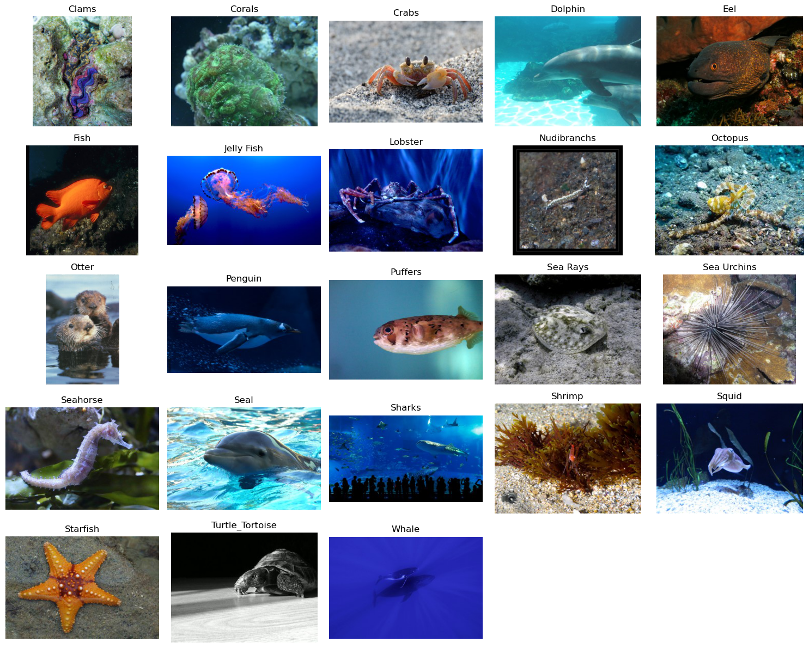
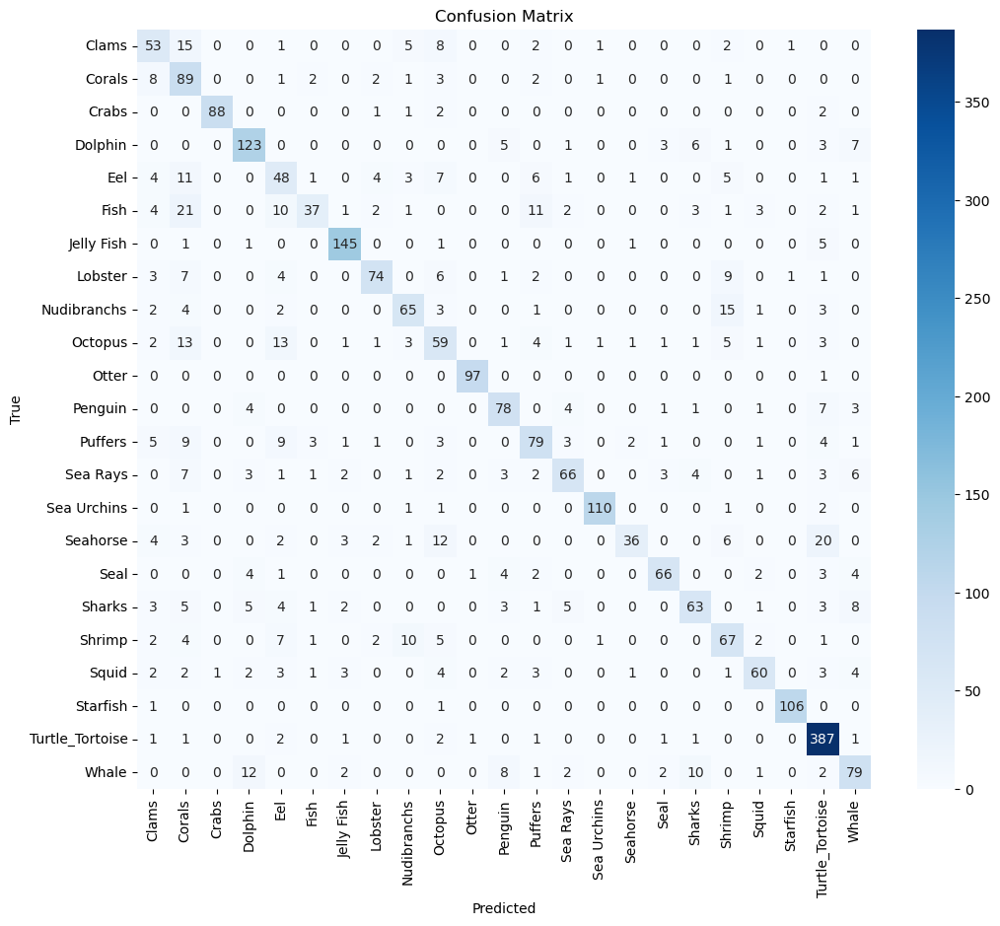
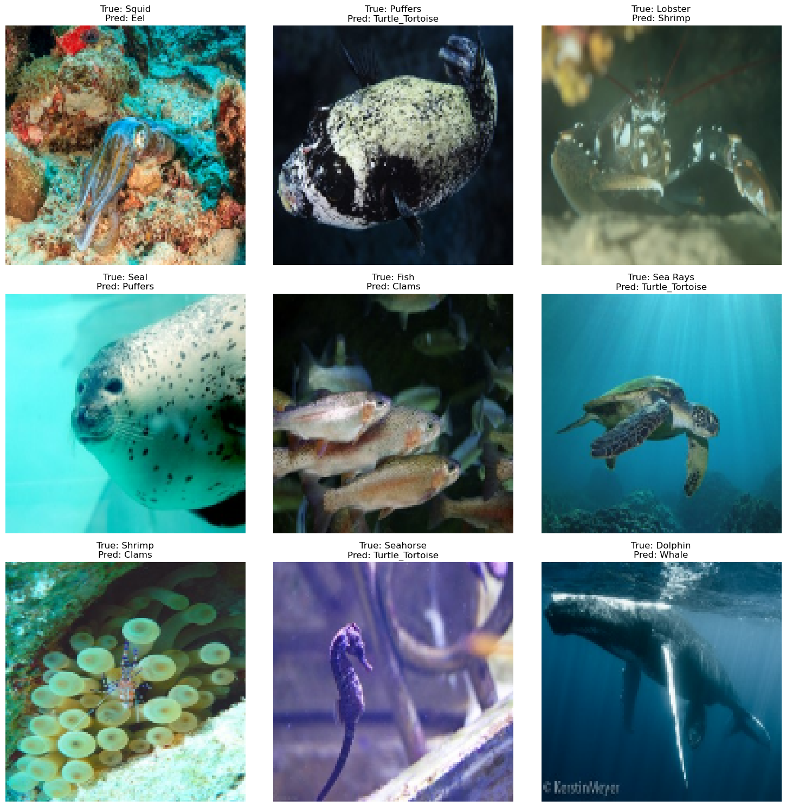

# Sea Animals Image Classification using CNNs and Transfer Learning

One of my practice Computer Vision projects developed during my MSc in Artificial Intelligence.

This project explores image classification on a Sea Animals dataset containing 23 marine species. The main objective was to gain hands-on experience with the complete Computer Vision workflow, from data exploration and preprocessing to model development, transfer learning, and error analysis.

---

## 📊 Dataset

The dataset contains images from 23 sea animal categories:

* Clams
* Corals
* Crabs
* Dolphin
* Eel
* Fish
* Jelly Fish
* Lobster
* Nudibranchs
* Octopus
* Otter
* Penguin
* Puffers
* Sea Rays
* Sea Urchins
* Seahorse
* Seal
* Sharks
* Shrimp
* Squid
* Starfish
* Turtle/Tortoise
* Whale

### Dataset Samples

---

## 🔍 Project Workflow

1. Dataset Loading
2. Data Exploration
3. Data Preprocessing
4. CNN Model Development
5. Data Augmentation
6. Transfer Learning with MobileNetV2
7. Model Evaluation
8. Error Analysis

---

## 🛠 Techniques Used

* Convolutional Neural Networks (CNNs)
* Transfer Learning
* MobileNetV2
* Data Augmentation
* Functional API
* Batch Normalization
* Dropout Regularization
* Early Stopping
* Confusion Matrix Analysis
* Error Analysis

---

## 📈 Results

### Best Validation Accuracy

| Model                         | Validation Accuracy |
| ----------------------------- | ------------------- |
| MobileNetV2 Transfer Learning | 75.7%               |

The transfer learning approach significantly improved performance and provided a strong baseline for multi-class marine species classification.

---

## 🖼 Visual Results

### Confusion Matrix

### Misclassified Examples

---

## 💻 Technologies

* Python
* TensorFlow
* Keras
* NumPy
* Pandas
* Matplotlib
* Seaborn
* Jupyter Notebook

---

## 🚀 Future Improvements

* Experiment with EfficientNet architectures
* Hyperparameter tuning
* Fine-tuning additional pretrained models
* Model explainability techniques (Grad-CAM)
* Advanced image augmentation strategies
* Larger-scale marine species datasets

---

## 🎓 Learning Objective

This project was developed as part of my preparation for the Artificial Intelligence and Machine Vision module during my MSc in Artificial Intelligence.

Rather than focusing solely on achieving the highest possible accuracy, the goal was to explore different Computer Vision techniques, compare approaches, and strengthen practical experience with real-world image classification tasks.

---

## 👩‍💻 Author

**Evangelia Karka**

MSc Artificial Intelligence Student
